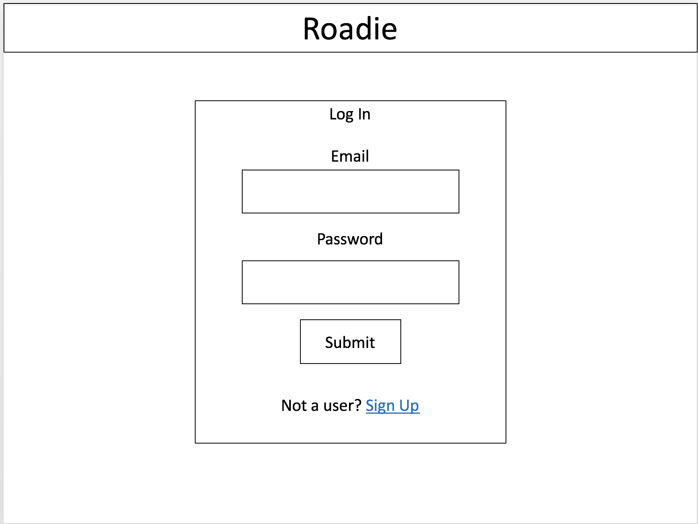

# Roadie

## Description

Roadie is a full stack application that allows users to enter the origin and destination of a road trip in order to find diners along their route where they can stop for a quick meal. Once a user has visited a diner, they can rate it and also add it to their profile to earn badges based on the number of diners they have visited over time.

## Wireframes

